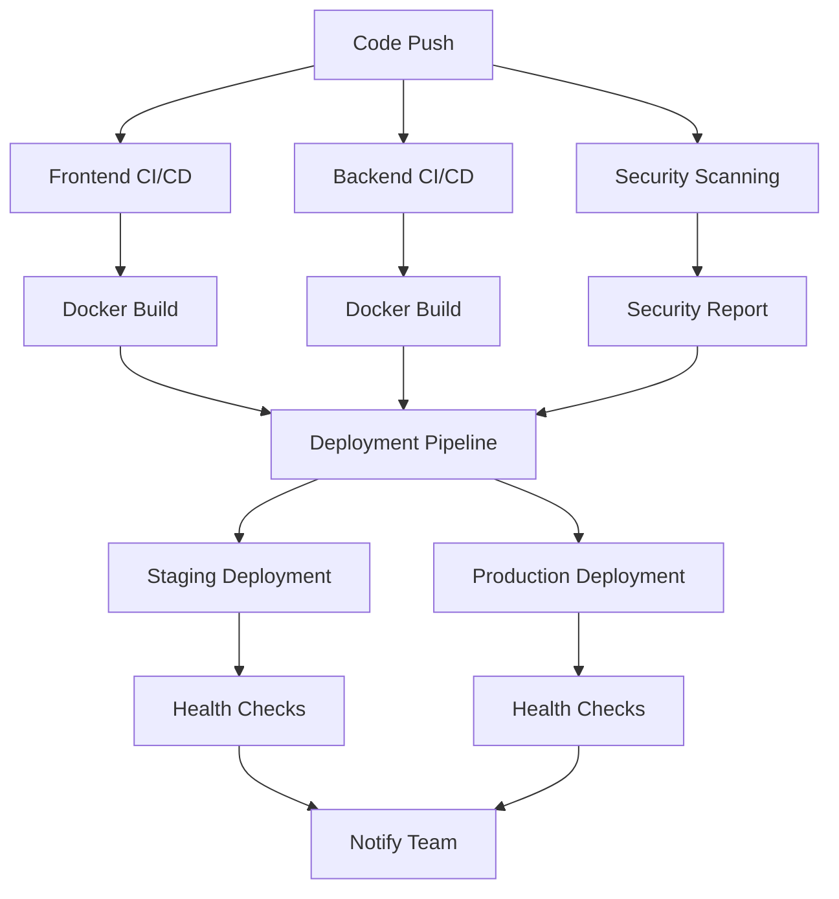

# CI/CD Pipeline Setup Guide

This guide explains how to set up and configure the CI/CD pipelines for the Hospital Portal application.

## Overview

Our CI/CD system includes:
- **Frontend Pipeline**: Next.js application build, test, and deployment
- **Backend Pipeline**: NestJS microservices build, test, and deployment
- **Security Pipeline**: Comprehensive security scanning and compliance checks
- **Deployment Pipeline**: Automated deployment to staging and production environments

## Pipeline Architecture



## Workflows

### 1. Frontend CI/CD Pipeline (`.github/workflows/frontend-ci.yml`)

**Triggers:**
- Push to `main`, `testing-phase`, `develop` branches
- Pull requests to `main`, `testing-phase`
- Changes to `frontend/**` directory

**Jobs:**
- **Lint and Test**: ESLint, TypeScript check, unit tests
- **Build**: Next.js production build
- **Docker Build**: Container image creation and push to GitHub Container Registry
- **Security Scan**: Trivy vulnerability scanning
- **Deploy to Staging**: Automatic deployment for testing branches
- **Deploy to Production**: Automatic deployment for main branch

### 2. Backend CI/CD Pipeline (`.github/workflows/backend-ci.yml`)

**Triggers:**
- Push to `main`, `testing-phase`, `develop` branches
- Pull requests to `main`, `testing-phase`
- Changes to `services/**` directory

**Jobs:**
- **Hospital Service CI**: Lint, test, and build
- **Build Hospital Service**: Compile TypeScript
- **Docker Build**: Multi-service container builds
- **Security Scan**: Container vulnerability scanning
- **Integration Tests**: End-to-end testing with MongoDB
- **Deploy**: Staging and production deployment

### 3. Security Pipeline (`.github/workflows/security.yml`)

**Triggers:**
- Daily schedule (2 AM UTC)
- Push to main branches
- Pull requests

**Jobs:**
- **Code Quality**: CodeQL analysis, Semgrep scanning
- **Dependency Scan**: npm audit, Snyk vulnerability scanning
- **Container Scan**: Trivy and Docker Scout security scanning
- **Infrastructure Scan**: Checkov and Terrascan for IaC security
- **License Check**: License compliance verification
- **Secrets Scan**: GitLeaks and TruffleHog for secret detection
- **Policy Compliance**: Security policy verification
- **Security Report**: Comprehensive security status report

### 4. Deployment Pipeline (`.github/workflows/deployment.yml`)

**Triggers:**
- Completion of Frontend and Backend CI/CD pipelines
- Only for successful builds

**Jobs:**
- **Check Workflows**: Verify all required workflows succeeded
- **Deploy to Staging**: Kubernetes deployment for testing environments
- **Deploy to Production**: Kubernetes deployment for production
- **Rollback**: Automatic rollback on deployment failure

## Setup Instructions

### 1. Repository Secrets

Configure the following secrets in your GitHub repository:

#### Required Secrets
```bash
# Container Registry
GITHUB_TOKEN  # Automatically provided by GitHub

# Database
MONGODB_URI  # MongoDB connection string

# JWT
JWT_SECRET  # Secret key for JWT tokens

# Kubernetes
KUBE_CONFIG_STAGING  # Base64 encoded kubeconfig for staging
KUBE_CONFIG_PRODUCTION  # Base64 encoded kubeconfig for production

# Security Scanning
SNYK_TOKEN  # Snyk API token
SEMGREP_APP_TOKEN  # Semgrep application token
DOCKER_SCOUT_TOKEN  # Docker Scout token
GITLEAKS_LICENSE  # GitLeaks license key

# Notifications
SLACK_WEBHOOK_URL  # Slack webhook for notifications

# API Configuration
NEXT_PUBLIC_HOSPITAL_API_URL  # Frontend API URL
```

#### How to Add Secrets
1. Go to your GitHub repository
2. Navigate to Settings → Secrets and variables → Actions
3. Click "New repository secret"
4. Add each secret with the appropriate value

### 2. Environment Setup

#### Staging Environment
```bash
# Create staging environment
kubectl create namespace hospital-portal-staging

# Apply staging configuration
kubectl apply -f k8s/namespace.yaml
kubectl apply -f k8s/staging/
```

#### Production Environment
```bash
# Create production environment
kubectl create namespace hospital-portal

# Apply production configuration
kubectl apply -f k8s/namespace.yaml
kubectl apply -f k8s/production/
```

### 3. Kubernetes Configuration

#### Namespace Setup
```yaml
# k8s/namespace.yaml
apiVersion: v1
kind: Namespace
metadata:
  name: hospital-portal
  labels:
    environment: production
```

#### Secrets Management
```bash
# Create MongoDB secret
kubectl create secret generic mongodb-secret \
  --from-literal=uri="your-mongodb-connection-string" \
  -n hospital-portal

# Create JWT secret
kubectl create secret generic jwt-secret \
  --from-literal=secret="your-jwt-secret-key" \
  -n hospital-portal
```

### 4. Container Registry Setup

#### GitHub Container Registry
The pipelines automatically push to GitHub Container Registry (`ghcr.io`).

**Images:**
- `ghcr.io/your-username/health/hospital-portal-frontend:latest`
- `ghcr.io/your-username/health/hospital-service:latest`
- `ghcr.io/your-username/health/audit-service:latest`
- `ghcr.io/your-username/health/consent-service:latest`
- `ghcr.io/your-username/health/notification-service:latest`

### 5. Monitoring and Notifications

#### Slack Integration
1. Create a Slack webhook URL
2. Add `SLACK_WEBHOOK_URL` secret
3. Notifications will be sent to `#deployments` and `#security` channels

#### GitHub Environments
Configure GitHub environments for deployment protection:

1. Go to Settings → Environments
2. Create `staging` and `production` environments
3. Add protection rules (required reviewers, wait timer)
4. Configure environment secrets

## Pipeline Features

### Automated Testing
- **Unit Tests**: Jest for frontend and backend
- **Integration Tests**: End-to-end testing with real databases
- **Security Tests**: Vulnerability scanning and compliance checks
- **Performance Tests**: Load testing for critical endpoints

### Security Scanning
- **Code Analysis**: CodeQL, Semgrep, ESLint security rules
- **Dependency Scanning**: npm audit, Snyk vulnerability detection
- **Container Scanning**: Trivy, Docker Scout for image vulnerabilities
- **Infrastructure Scanning**: Checkov, Terrascan for IaC security
- **Secrets Detection**: GitLeaks, TruffleHog for credential scanning

### Deployment Strategies
- **Blue-Green Deployment**: Zero-downtime production deployments
- **Rolling Updates**: Gradual service updates
- **Canary Releases**: Gradual traffic shifting
- **Automatic Rollback**: Failed deployment detection and rollback

### Monitoring and Observability
- **Health Checks**: Application and service health monitoring
- **Metrics Collection**: Prometheus for system metrics
- **Log Aggregation**: ELK stack for centralized logging
- **Distributed Tracing**: Jaeger for request tracing

## Best Practices

### Code Quality
- All code must pass linting and formatting checks
- Test coverage must be above 80%
- Security vulnerabilities must be resolved before deployment
- Dependencies must be regularly updated

### Security
- Secrets are never committed to version control
- All containers are scanned for vulnerabilities
- Security policies are enforced automatically
- Regular security audits are performed

### Deployment
- Staging deployment is required before production
- Production deployments require approval
- Rollback procedures are automated
- Health checks are performed after each deployment

## Troubleshooting

### Common Issues

#### Pipeline Failures
1. **Check logs**: Review GitHub Actions logs for detailed error messages
2. **Verify secrets**: Ensure all required secrets are configured
3. **Test locally**: Reproduce issues in local development environment
4. **Check dependencies**: Verify all dependencies are up to date

#### Deployment Issues
1. **Kubernetes connectivity**: Verify kubeconfig and cluster access
2. **Resource limits**: Check if pods have sufficient resources
3. **Service dependencies**: Ensure all required services are running
4. **Network policies**: Verify network connectivity between services

#### Security Scan Failures
1. **False positives**: Review and whitelist known false positives
2. **Dependency updates**: Update vulnerable dependencies
3. **Configuration issues**: Fix security misconfigurations
4. **Policy violations**: Address security policy violations

### Getting Help
- Check GitHub Actions logs for detailed error messages
- Review security scan reports for specific issues
- Consult the troubleshooting section in each workflow file
- Contact the development team for assistance

## Maintenance

### Regular Tasks
- **Weekly**: Review and update dependencies
- **Monthly**: Security scan review and remediation
- **Quarterly**: Pipeline performance optimization
- **Annually**: Security policy review and updates

### Monitoring
- Pipeline execution time and success rates
- Security scan results and trends
- Deployment frequency and success rates
- Resource utilization and costs

This CI/CD setup provides a robust, secure, and automated deployment pipeline for the Hospital Portal application, ensuring high-quality, secure, and reliable software delivery.
