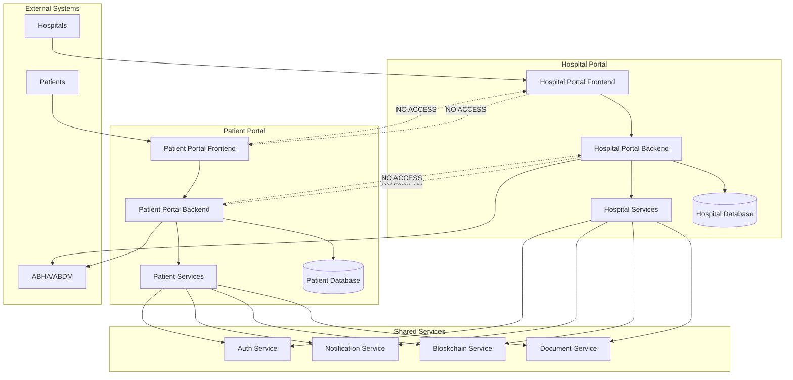

# Corrected System Architecture - Hospital Portal & Patient Portal

## Overview

The Hospital Portal and Patient Portal are **completely separate applications** with distinct purposes, users, and access controls. They communicate only through secure, consent-based APIs.

## System Architecture



## Portal Separation

### 🏥 Hospital Portal
**Purpose**: Hospital staff manage hospital operations, staff, and patient data (with consent)

**Users**:
- Hospital Administrators
- Doctors
- Nurses
- Lab Technicians
- Billing Staff
- IT Administrators

**Features**:
- Hospital registration and management
- Staff user management
- Patient search and linking (via ABHA ID)
- Document upload and management
- Consent management for patient data
- Analytics and reporting
- Audit trails

**Access Control**:
- Role-based access control (RBAC)
- Hospital-specific data isolation
- Staff permission management
- Audit logging

### 👤 Patient Portal
**Purpose**: Patients manage their personal health records and control data sharing

**Users**:
- Patients
- Authorized Family Members
- Authorized Caregivers

**Features**:
- Personal health record (PHR) management
- Document management and sharing
- Consent management for data sharing
- Health insights and analytics
- Appointment management
- Medication tracking

**Access Control**:
- Patient-specific data access
- Granular consent controls
- Family member authorization
- Caregiver permissions

## Data Flow & Integration

### Hospital → Patient Data Flow
1. **Hospital uploads document** for patient
2. **Patient receives notification** in their portal
3. **Patient grants consent** to view document
4. **Document appears** in patient's portal
5. **Patient can download/view** the document

### Patient → Hospital Data Flow
1. **Patient uploads document** (lab results, etc.)
2. **Patient grants consent** to specific hospital
3. **Hospital receives notification**
4. **Hospital can access** patient's shared documents
5. **Hospital can use** for treatment decisions

### Consent Management
- **Granular Controls**: Patients control exactly what data is shared
- **Time-based**: Consent can be time-limited
- **Purpose-based**: Consent for specific purposes only
- **Revocable**: Patients can revoke consent at any time
- **Audit Trail**: Complete history of consent changes

## API Communication

### Hospital Portal APIs
```
GET    /api/hospitals                    # Hospital management
POST   /api/hospitals                    # Register hospital
GET    /api/hospitals/{id}/patients      # Get linked patients
POST   /api/hospitals/{id}/patients      # Link patient
GET    /api/hospitals/{id}/documents     # Get hospital documents
POST   /api/hospitals/{id}/documents     # Upload document
GET    /api/hospitals/{id}/consents      # Get patient consents
POST   /api/hospitals/{id}/consents      # Request consent
```

### Patient Portal APIs
```
GET    /api/patients/{id}/profile        # Patient profile
PUT    /api/patients/{id}/profile        # Update profile
GET    /api/patients/{id}/documents      # Get patient documents
POST   /api/patients/{id}/documents      # Upload document
GET    /api/patients/{id}/consents       # Get consent status
POST   /api/patients/{id}/consents       # Grant/revoke consent
GET    /api/patients/{id}/hospitals      # Get linked hospitals
POST   /api/patients/{id}/hospitals      # Link hospital
```

### Shared Service APIs
```
# Document Service
POST   /api/documents/upload             # Upload document
GET    /api/documents/{id}               # Get document
DELETE /api/documents/{id}               # Delete document

# Blockchain Service
POST   /api/blockchain/anchor            # Anchor document hash
GET    /api/blockchain/verify/{id}       # Verify document

# Notification Service
POST   /api/notifications/send           # Send notification
GET    /api/notifications/{user}         # Get notifications
```

## Security & Compliance

### Data Isolation
- **Complete Separation**: Hospital and patient data are completely isolated
- **No Cross-Access**: Users cannot access the other portal
- **API-Only Communication**: All data sharing through secure APIs
- **Consent-Based**: All data sharing requires explicit consent

### Authentication & Authorization
- **Separate Auth Systems**: Each portal has its own authentication
- **Role-Based Access**: Different roles for different user types
- **Multi-Factor Authentication**: Enhanced security for sensitive operations
- **Session Management**: Secure session handling

### Data Protection
- **Encryption**: All data encrypted at rest and in transit
- **Audit Logging**: Complete audit trail for all operations
- **Privacy Controls**: Granular privacy and consent controls
- **Compliance**: HIPAA, GDPR, and ABDM compliance

## Deployment Architecture

### Separate Applications
```
hospital-portal.com     # Hospital Portal
├── Frontend (Next.js)
├── Backend (NestJS)
└── Database (MongoDB)

patient-portal.com      # Patient Portal
├── Frontend (Next.js)
├── Backend (NestJS)
└── Database (MongoDB)
```

### Shared Infrastructure
```
shared-services.com     # Shared Services
├── Document Service
├── Blockchain Service
├── Notification Service
└── Auth Service
```

## Benefits of Separation

### 🔒 Security
- **Reduced Attack Surface**: Separate systems reduce security risks
- **Data Isolation**: Complete separation of sensitive data
- **Compliance**: Easier to meet regulatory requirements

### 🚀 Scalability
- **Independent Scaling**: Each portal can scale independently
- **Performance**: Optimized for specific use cases
- **Maintenance**: Easier to maintain and update

### 👥 User Experience
- **Focused Interface**: Each portal optimized for its users
- **Simplified Navigation**: No confusion between different user types
- **Role-Specific Features**: Features tailored to user needs

### 🏗️ Development
- **Team Separation**: Different teams can work on different portals
- **Technology Choices**: Different tech stacks if needed
- **Independent Deployment**: Deploy changes independently

## Migration from Current Architecture

### Steps to Correct Architecture
1. **Remove Portal Navigation**: Remove cross-portal navigation components
2. **Separate Applications**: Create separate frontend applications
3. **Update APIs**: Ensure APIs reflect proper separation
4. **Update Documentation**: Correct all architectural documentation
5. **Update CI/CD**: Separate deployment pipelines
6. **Update Security**: Implement proper access controls

This corrected architecture ensures proper separation of concerns, enhanced security, and better user experience for both hospitals and patients.
