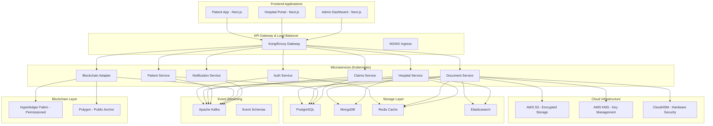
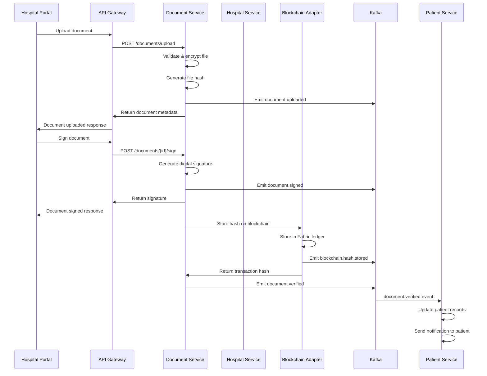
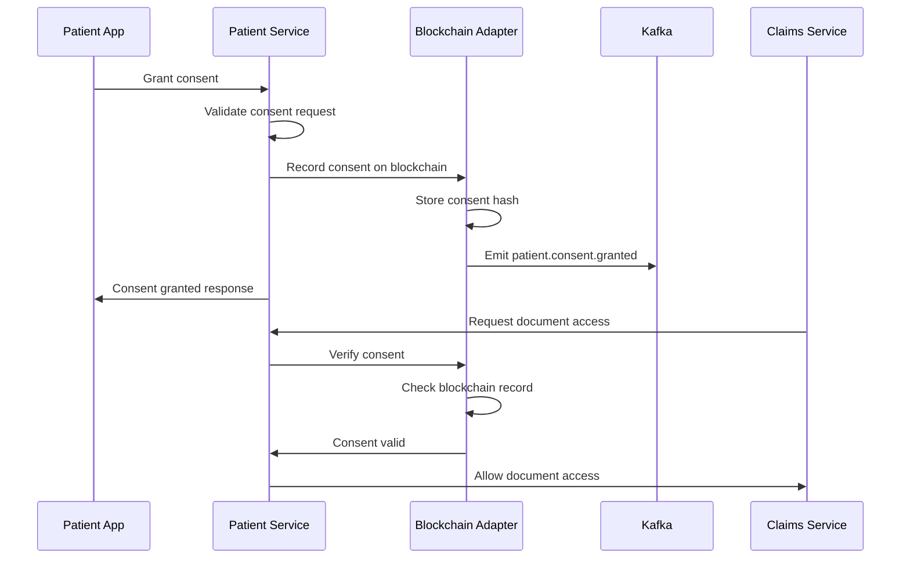

# SecureHealth Hospital Portal Implementation

## 🏥 Enterprise Healthcare Platform Architecture

This document outlines the complete implementation of the SecureHealth Hospital Portal - an enterprise-grade, scalable healthcare platform that integrates seamlessly with the existing patient wallet application.

## 📋 Table of Contents

1. [Architecture Overview](#architecture-overview)
2. [Microservices Implementation](#microservices-implementation)
3. [API Contracts](#api-contracts)
4. [Event-Driven Architecture](#event-driven-architecture)
5. [Infrastructure Setup](#infrastructure-setup)
6. [Security & Compliance](#security--compliance)
7. [Deployment Guide](#deployment-guide)
8. [Integration Flows](#integration-flows)
9. [Monitoring & Operations](#monitoring--operations)
10. [Roadmap & Timeline](#roadmap--timeline)

## 🏗️ Architecture Overview

### High-Level Architecture



### Key Design Principles

1. **🔒 Never store PHI on-chain** - Only cryptographic hashes and metadata
2. **🏢 Multi-tenant isolation** - Each hospital/insurer is a separate tenant
3. **⚡ Event-driven architecture** - Kafka for scalable microservices communication
4. **🔗 Hybrid blockchain** - Permissioned ledger + public anchoring
5. **🛡️ Zero-trust security** - mTLS, RBAC, encryption at rest and in transit

## 🔧 Microservices Implementation

### 1. Document Service (`services/document-service/`)

**Purpose**: Handles document upload, encryption, storage, and verification

**Key Features**:
- AES-256-GCM encryption for file content
- IPFS/S3 storage with versioning
- Malicious file detection
- SHA-256 integrity verification
- Blockchain hash anchoring

**API Endpoints**:
```yaml
POST /documents/upload          # Upload and encrypt document
GET  /documents/{id}/metadata   # Get document metadata
GET  /documents/{id}/download   # Download decrypted document
POST /documents/{id}/sign       # Sign document digitally
POST /documents/{id}/verify     # Verify on blockchain
DELETE /documents/{id}          # Delete document
```

### 2. Blockchain Adapter Service (`services/blockchain-adapter/`)

**Purpose**: Manages hybrid blockchain operations (permissioned + public)

**Key Features**:
- Hyperledger Fabric integration
- Polygon/Ethereum anchoring
- Merkle tree batching
- Transaction verification
- Gas optimization

**API Endpoints**:
```yaml
POST /blockchain/hash/store     # Store hash in permissioned ledger
GET  /blockchain/hash/verify    # Verify hash on blockchain
POST /blockchain/anchor         # Anchor batch to public chain
GET  /blockchain/stats          # Get blockchain statistics
GET  /blockchain/health         # Health check
```

### 3. Hospital Service (`services/hospital-service/`)

**Purpose**: Manages hospital operations, user management, and patient linking

**Key Features**:
- Hospital onboarding and KYC
- Role-based access control (RBAC)
- Patient search and linking
- Document signing workflows
- Audit trails

**API Endpoints**:
```yaml
POST /hospitals/register        # Register new hospital
GET  /hospitals                 # List hospitals
GET  /hospitals/{id}            # Get hospital details
POST /hospitals/{id}/users      # Create hospital user
POST /hospitals/{id}/patients/search  # Search patients
POST /hospitals/{id}/documents  # Upload document
```

### 4. Auth Service (`services/auth-service/`)

**Purpose**: Centralized authentication and authorization

**Key Features**:
- OAuth2/OIDC with Keycloak
- ABHA/Aadhaar integration
- Multi-factor authentication
- JWT token management
- Session management

**API Endpoints**:
```yaml
POST /auth/login                # User/hospital login
POST /auth/refresh              # Refresh access token
POST /auth/logout               # Logout user
GET  /auth/profile              # Get user profile
POST /auth/verify-abha          # Verify ABHA ID
```

## 📡 API Contracts

### Complete OpenAPI Specification

The complete API specification is available at:
- **File**: `docs/api-contracts/openapi.yaml`
- **Version**: 1.0.0
- **Coverage**: All microservices endpoints
- **Authentication**: Bearer tokens + API keys
- **Rate Limiting**: Per-service and per-endpoint

### Key API Features

1. **🔐 Security-First Design**
   - JWT tokens with short expiration
   - Refresh token rotation
   - Rate limiting per endpoint
   - Request/response validation

2. **📊 Comprehensive Documentation**
   - Interactive Swagger UI
   - Example requests/responses
   - Error code definitions
   - Authentication flows

3. **🔄 Event-Driven Integration**
   - Webhook support
   - Real-time notifications
   - Async processing
   - Retry mechanisms

## 🎯 Event-Driven Architecture

### Kafka Event Schemas

**File**: `docs/event-schemas/kafka-events.yaml`

### Event Topics

1. **`document.events`** - Document lifecycle
   - `document.uploaded`
   - `document.signed`
   - `document.verified`

2. **`patient.events`** - Patient operations
   - `patient.consent.granted`
   - `patient.consent.revoked`
   - `patient.linked`

3. **`hospital.events`** - Hospital operations
   - `hospital.registered`
   - `hospital.verified`
   - `hospital.user.created`

4. **`blockchain.events`** - Blockchain operations
   - `blockchain.hash.stored`
   - `blockchain.anchor.initiated`
   - `blockchain.anchor.completed`

5. **`claims.events`** - Insurance claims
   - `claim.submitted`
   - `claim.approved`
   - `claim.rejected`

6. **`notification.events`** - Notifications
   - `notification.sms.queued`
   - `notification.email.queued`
   - `notification.push.queued`

### Event Processing Patterns

- **Saga Pattern**: Long-running transactions across services
- **CQRS**: Command Query Responsibility Segregation
- **Event Sourcing**: Immutable audit trails
- **Dead Letter Queues**: Error handling and retry logic

## ☁️ Infrastructure Setup

### Kubernetes Configuration

**Files**:
- `infra/k8s/namespace.yaml` - Namespace definitions
- `infra/k8s/api-gateway.yaml` - Kong API Gateway
- `infra/k8s/kafka-cluster.yaml` - Strimzi Kafka cluster

### Terraform Infrastructure

**Files**:
- `infra/terraform/main.tf` - Main infrastructure
- `infra/terraform/variables.tf` - Configuration variables

### AWS Resources

1. **EKS Cluster** - Kubernetes orchestration
2. **RDS PostgreSQL** - Primary transactional database
3. **ElastiCache Redis** - Caching and session storage
4. **S3 Buckets** - Encrypted document storage
5. **KMS Keys** - Encryption key management
6. **CloudHSM** - Hardware security modules

### Service Mesh (Linkerd/Istio)

- **mTLS**: Service-to-service encryption
- **Traffic Management**: Load balancing, routing
- **Observability**: Metrics, logs, traces
- **Security Policies**: Network segmentation

## 🔐 Security & Compliance

### Data Protection

1. **Encryption at Rest**
   - AES-256 for file storage
   - KMS-managed database encryption
   - Encrypted backups

2. **Encryption in Transit**
   - TLS 1.3 for all communications
   - mTLS for service-to-service
   - Certificate pinning

3. **Key Management**
   - AWS KMS for encryption keys
   - CloudHSM for signing keys
   - Key rotation policies

### Compliance Framework

1. **HIPAA Compliance**
   - PHI encryption requirements
   - Audit trail maintenance
   - Access control policies
   - Business Associate Agreements

2. **ABDM Integration**
   - ABHA Health ID support
   - FHIR R4 compliance
   - PHR app certification

3. **Data Privacy**
   - DPDP Act compliance
   - Right to be forgotten
   - Data minimization
   - Consent management

### Security Monitoring

1. **SIEM Integration**
   - Centralized log collection
   - Threat detection
   - Incident response

2. **Penetration Testing**
   - Regular security audits
   - Vulnerability assessments
   - Red team exercises

## 🚀 Deployment Guide

### Prerequisites

1. **AWS Account** with appropriate permissions
2. **Terraform** >= 1.0
3. **kubectl** >= 1.28
4. **Helm** >= 3.11
5. **Docker** for container builds

### Step 1: Infrastructure Setup

```bash
# Clone repository
git clone https://github.com/your-org/securehealth-platform.git
cd securehealth-platform

# Initialize Terraform
cd infra/terraform
terraform init

# Configure variables
cp terraform.tfvars.example terraform.tfvars
# Edit terraform.tfvars with your values

# Deploy infrastructure
terraform plan
terraform apply
```

### Step 2: Kubernetes Setup

```bash
# Configure kubectl
aws eks update-kubeconfig --region us-west-2 --name securehealth-production-cluster

# Deploy namespaces
kubectl apply -f infra/k8s/namespace.yaml

# Deploy Kafka cluster
kubectl apply -f infra/k8s/kafka-cluster.yaml

# Deploy API Gateway
kubectl apply -f infra/k8s/api-gateway.yaml
```

### Step 3: Service Deployment

```bash
# Build and push Docker images
./scripts/build-images.sh

# Deploy services using Helm
helm install document-service ./charts/document-service
helm install blockchain-adapter ./charts/blockchain-adapter
helm install hospital-service ./charts/hospital-service
helm install auth-service ./charts/auth-service
```

### Step 4: Configuration

```bash
# Create secrets
kubectl create secret generic database-credentials \
  --from-literal=username=postgres \
  --from-literal=password=<your-password>

kubectl create secret generic kafka-credentials \
  --from-literal=username=kafka \
  --from-literal=password=<your-password>

# Apply configurations
kubectl apply -f k8s/configmaps/
kubectl apply -f k8s/secrets/
```

## 🔄 Integration Flows

### Hospital Document Upload Flow



### Patient Consent Flow



## 📊 Monitoring & Operations

### Observability Stack

1. **Metrics**: Prometheus + Grafana
2. **Logs**: ELK Stack (Elasticsearch, Logstash, Kibana)
3. **Traces**: Jaeger/OpenTelemetry
4. **APM**: New Relic/Datadog

### Key Metrics

1. **Application Metrics**
   - Request rate and latency
   - Error rates by service
   - Database connection pools
   - Cache hit rates

2. **Infrastructure Metrics**
   - CPU and memory usage
   - Disk I/O and network
   - Kubernetes pod health
   - AWS resource utilization

3. **Business Metrics**
   - Document upload success rate
   - Blockchain transaction confirmation time
   - Hospital onboarding completion rate
   - Patient consent grant rate

### Alerting Rules

```yaml
# Example Prometheus alerting rules
groups:
- name: securehealth.rules
  rules:
  - alert: HighErrorRate
    expr: rate(http_requests_total{status=~"5.."}[5m]) > 0.1
    for: 5m
    labels:
      severity: critical
    annotations:
      summary: High error rate detected

  - alert: BlockchainTransactionFailure
    expr: rate(blockchain_transactions_failed_total[5m]) > 0.05
    for: 2m
    labels:
      severity: warning
    annotations:
      summary: Blockchain transaction failures increasing
```

## 📅 Roadmap & Timeline

### Phase 1: MVP Foundation (Weeks 1-16)

**Weeks 1-4: Architecture & Infrastructure**
- [x] Complete API contracts and event schemas
- [x] Infrastructure setup (EKS, Kafka, databases)
- [x] CI/CD pipeline configuration
- [x] Security baseline implementation

**Weeks 5-8: Core Services**
- [ ] Document Service implementation
- [ ] Blockchain Adapter Service
- [ ] Hospital Service (basic)
- [ ] Auth Service integration

**Weeks 9-12: Frontend Development**
- [ ] Hospital Portal UI
- [ ] Patient App integration
- [ ] Admin Dashboard
- [ ] Mobile responsive design

**Weeks 13-16: Integration & Testing**
- [ ] End-to-end testing
- [ ] Performance optimization
- [ ] Security testing
- [ ] Pilot hospital onboarding

### Phase 2: Scale & Harden (Weeks 17-40)

**Weeks 17-24: Advanced Features**
- [ ] FHIR server implementation
- [ ] EHR connectors (HL7, Mirth)
- [ ] Advanced analytics dashboard
- [ ] Fraud detection engine

**Weeks 25-32: Enterprise Features**
- [ ] Multi-tenant isolation
- [ ] Advanced RBAC
- [ ] Audit compliance tools
- [ ] SLA monitoring

**Weeks 33-40: Production Readiness**
- [ ] Load testing and optimization
- [ ] Disaster recovery setup
- [ ] Security audits
- [ ] Documentation completion

### Phase 3: Enterprise Rollout (Weeks 41+)

**Weeks 41-52: Enterprise Onboarding**
- [ ] Large hospital network integration
- [ ] Insurer partnerships
- [ ] Regulatory compliance certification
- [ ] Support team scaling

**Weeks 53+: Global Expansion**
- [ ] International deployments
- [ ] Multi-region architecture
- [ ] Advanced AI/ML features
- [ ] Ecosystem partnerships

## 👥 Team Requirements

### Core Development Team

1. **Technical Lead/Architect** (1)
   - Microservices architecture
   - Blockchain integration
   - System design

2. **Backend Engineers** (4-5)
   - NestJS/Node.js development
   - Database design
   - API development
   - Event streaming

3. **Frontend Engineers** (2-3)
   - Next.js/React development
   - UI/UX implementation
   - Mobile optimization

4. **Blockchain Engineer** (1)
   - Smart contract development
   - Hyperledger Fabric
   - Public blockchain integration

5. **DevOps Engineer** (1-2)
   - Kubernetes management
   - CI/CD pipelines
   - Infrastructure automation
   - Monitoring setup

6. **Data Engineer** (1)
   - Analytics pipelines
   - Data warehousing
   - ML model deployment

7. **QA Engineer** (1-2)
   - Test automation
   - Performance testing
   - Security testing

8. **Implementation Manager** (1)
   - Hospital onboarding
   - Training and support
   - Customer success

### Estimated Costs (Annual)

- **Team Salaries**: $1.2M - $1.8M
- **AWS Infrastructure**: $50K - $200K (scales with usage)
- **Third-party Services**: $30K - $100K
- **Security & Compliance**: $20K - $50K
- **Total**: $1.3M - $2.15M

## 🎯 Success Metrics

### Technical KPIs

1. **Performance**
   - API response time < 200ms (95th percentile)
   - Document upload success rate > 99.9%
   - System uptime > 99.95%

2. **Scalability**
   - Support 1000+ concurrent users
   - Process 10,000+ documents/day
   - Handle 100+ hospitals

3. **Security**
   - Zero data breaches
   - 100% encrypted data at rest
   - Regular security audits passed

### Business KPIs

1. **Adoption**
   - 50+ hospitals onboarded in Year 1
   - 100,000+ patient records processed
   - 10+ insurance partnerships

2. **Efficiency**
   - 90% reduction in document verification time
   - 80% faster insurance claim processing
   - 95% patient satisfaction score

3. **Compliance**
   - HIPAA compliance certification
   - ABDM integration completed
   - SOC 2 Type II certification

---

## 🚀 Getting Started

To begin implementation:

1. **Review the architecture** and technical specifications
2. **Set up the development environment** using the provided scripts
3. **Start with the Document Service** as the foundation
4. **Implement the Blockchain Adapter** for hybrid ledger support
5. **Build the Hospital Portal** UI components
6. **Integrate with the existing Patient App**

For questions or support, contact the SecureHealth development team at dev@securehealth.app.

---

*This document is living documentation and will be updated as the platform evolves.*

