# 🏥 Hospital/Doctor Portal - Complete Implementation Plan

## 📋 Overview

This document outlines the complete implementation plan for the Hospital/Doctor Portal that integrates seamlessly with the existing Patient Portal while maintaining strict data security and consent management.

## 🎯 Core Objectives

1. **Provider-Side Interface**: Enable doctors/hospitals to manage patient data
2. **Secure Data Exchange**: Controlled sharing between patient and hospital interfaces
3. **Consent-Based Access**: All data access requires explicit patient consent
4. **Blockchain Verification**: Document authenticity and integrity verification
5. **Real-Time Updates**: Event-driven synchronization between systems

---

## 🏗️ Architecture Overview

### Service Integration Flow
```
Hospital Portal → API Gateway → [Auth Service, Patient Service, Document Service, Consent Service, Blockchain Service]
                                    ↓
Patient Portal ← API Gateway ← [Same Services with different access controls]
```

### Data Flow Principles
- **Hospital produces**: New documents, doctor notes, visit records
- **Hospital consumes**: Patient identity, consent tokens, existing history
- **Patient controls**: All consent grants/revokes, data access permissions

---

## 📊 Data Exchange Matrix

| Data Type | Direction | Consent Required | Storage | Access Level |
|-----------|-----------|------------------|---------|--------------|
| Patient Identity | Hospital ← Patient | ✅ | Patient DB | Read Only |
| Health Records | Hospital → Patient | ✅ | Document DB + S3 | Upload/Read |
| Doctor Notes | Hospital → Patient | ✅ | Timeline DB | Create/Read |
| Consent Tokens | Hospital ← Patient | ✅ | Consent DB | Read Only |
| Visit Records | Hospital → Patient | ✅ | Hospital DB | Create/Read |
| Verification Proofs | Hospital → Patient | ✅ | Blockchain | Create/Read |

---

## 🎨 UI/UX Structure

### Header Navigation
```
🏥 Hospital Portal
├── 📊 Dashboard
├── 👥 Patients
├── 📄 Documents
├── 📅 Timeline
├── ✅ Consent Requests
├── 🔔 Notifications
├── ⚙️ Profile & Settings
└── 🚪 Logout
```

### Page Hierarchy
```
Hospital Portal
├── /dashboard - Overview metrics
├── /patients - Patient search & management
├── /patients/[id] - Individual patient view
├── /documents - Upload & manage documents
├── /documents/[id] - Document details & verification
├── /timeline - Patient interaction history
├── /consent - Consent request management
├── /notifications - System notifications
├── /profile - Hospital/doctor profile
└── /settings - System preferences
```

---

## 🔄 API Flow Examples

### 1. Hospital Uploads Lab Report


### 2. Hospital Views Patient History

```mermaid
sequenceDiagram
    participant H as Hospital Portal
    participant AG as API Gateway
    participant CS as Consent Service
    participant PS as Patient Service
    participant DS as Document Service

    H->>AG: GET /patients/{id}/history
    AG->>CS: Check consent status
    CS-->>AG: Consent: ✅ Active / ❌ Revoked / ⏳ Pending
    alt Consent Active
        AG->>PS: Fetch patient timeline
        AG->>DS: Fetch document metadata
        PS-->>AG: Return timeline data
        DS-->>AG: Return document list
        AG-->>H: Display patient history
    else No Consent
        AG-->>H: Redirect to consent request
    end
```


---

## 🗄️ Data Storage Strategy

### Database Schema Design

#### 1. Hospital Database
```sql
-- Hospital profiles
hospitals (
  hospital_id UUID PRIMARY KEY,
  name VARCHAR(255),
  registration_number VARCHAR(100),
  type ENUM('general', 'specialty', 'clinic'),
  address JSON,
  contact_info JSON,
  specialties TEXT[],
  status ENUM('active', 'pending', 'suspended'),
  created_at TIMESTAMP,
  updated_at TIMESTAMP
);

-- Hospital users (doctors/staff)
hospital_users (
  user_id UUID PRIMARY KEY,
  hospital_id UUID REFERENCES hospitals(hospital_id),
  email VARCHAR(255),
  role ENUM('admin', 'doctor', 'staff'),
  permissions JSON,
  status ENUM('active', 'inactive'),
  created_at TIMESTAMP
);
```

#### 2. Document Database
```sql
-- Document metadata
documents (
  document_id UUID PRIMARY KEY,
  patient_id UUID,
  hospital_id UUID,
  uploader_id UUID,
  title VARCHAR(255),
  category ENUM('lab_report', 'prescription', 'discharge_summary', 'consultation'),
  file_path VARCHAR(500),
  file_hash VARCHAR(64),
  file_size BIGINT,
  mime_type VARCHAR(100),
  blockchain_hash VARCHAR(64),
  verification_status ENUM('pending', 'verified', 'failed'),
  created_at TIMESTAMP
);

-- Document access logs
document_access_logs (
  log_id UUID PRIMARY KEY,
  document_id UUID REFERENCES documents(document_id),
  accessed_by UUID,
  access_type ENUM('view', 'download', 'verify'),
  ip_address INET,
  user_agent TEXT,
  accessed_at TIMESTAMP
);
```

#### 3. Consent Database
```sql
-- Consent records
consents (
  consent_id UUID PRIMARY KEY,
  patient_id UUID,
  hospital_id UUID,
  consent_type ENUM('view_records', 'upload_records', 'share_data'),
  status ENUM('pending', 'granted', 'denied', 'revoked'),
  granted_at TIMESTAMP,
  expires_at TIMESTAMP,
  created_at TIMESTAMP
);

-- Consent history (immutable)
consent_history (
  history_id UUID PRIMARY KEY,
  consent_id UUID REFERENCES consents(consent_id),
  action ENUM('created', 'granted', 'denied', 'revoked', 'expired'),
  actor_id UUID,
  actor_type ENUM('patient', 'hospital', 'system'),
  metadata JSON,
  timestamp TIMESTAMP
);
```

#### 4. Timeline Database
```sql
-- Patient interaction timeline
timeline_events (
  event_id UUID PRIMARY KEY,
  patient_id UUID,
  hospital_id UUID,
  event_type ENUM('visit', 'document_upload', 'consent_granted', 'consent_revoked'),
  title VARCHAR(255),
  description TEXT,
  metadata JSON,
  document_id UUID REFERENCES documents(document_id),
  created_at TIMESTAMP
);
```

---

## 🔐 Security & Compliance

### 1. Authentication & Authorization
- **JWT Tokens**: Separate tokens for hospital vs patient users
- **RBAC**: Role-based access control (admin, doctor, staff)
- **2FA**: Optional two-factor authentication
- **Session Management**: Secure session handling with timeouts

### 2. Data Protection
- **Encryption**: AES-256 encryption for data at rest
- **Transport**: TLS 1.3 for data in transit
- **Key Management**: AWS KMS or HashiCorp Vault
- **Audit Logs**: Comprehensive logging for compliance

### 3. Consent Management
- **Granular Permissions**: View, upload, share data permissions
- **Time-Limited**: Consent expires after specified duration
- **Revocable**: Patients can revoke consent anytime
- **Immutable Logs**: All consent changes logged permanently

### 4. Blockchain Integration
- **Document Hashes**: Store file hashes for integrity verification
- **Smart Contracts**: Automated consent verification
- **Public Anchoring**: Periodic anchoring to public blockchain
- **Proof Generation**: Cryptographic proofs for document authenticity

---

## 🚀 Implementation Phases

### Phase 1: Core Infrastructure (Week 1-2)
- [ ] Database schema setup
- [ ] API Gateway configuration
- [ ] Authentication service integration
- [ ] Basic hospital dashboard

### Phase 2: Patient Management (Week 3-4)
- [ ] Patient search functionality
- [ ] Patient profile view
- [ ] Consent request system
- [ ] Basic timeline view

### Phase 3: Document Management (Week 5-6)
- [ ] Document upload system
- [ ] File storage integration (S3/MinIO)
- [ ] Document verification
- [ ] Blockchain hash storage

### Phase 4: Advanced Features (Week 7-8)
- [ ] Real-time notifications
- [ ] Advanced search & filtering
- [ ] Audit logging
- [ ] Performance optimization

### Phase 5: Integration & Testing (Week 9-10)
- [ ] End-to-end testing
- [ ] Security testing
- [ ] Performance testing
- [ ] User acceptance testing

---

## 📈 Success Metrics

### Technical Metrics
- **Response Time**: < 200ms for API calls
- **Uptime**: 99.9% availability
- **File Upload**: < 5s for 10MB files
- **Search Performance**: < 1s for patient search

### Business Metrics
- **User Adoption**: 80% of hospitals onboard within 3 months
- **Document Uploads**: 1000+ documents per day
- **Consent Rate**: 90% patient consent approval rate
- **Data Accuracy**: 99.9% document verification success

---

## 🔧 Technology Stack

### Frontend
- **Framework**: Next.js 15 with TypeScript
- **UI Library**: Tailwind CSS + Radix UI
- **State Management**: React Context + Zustand
- **Charts**: Recharts for dashboard metrics

### Backend
- **API Gateway**: Kong or AWS API Gateway
- **Microservices**: NestJS with TypeScript
- **Database**: PostgreSQL + MongoDB
- **File Storage**: AWS S3 or MinIO
- **Message Queue**: Apache Kafka
- **Blockchain**: Hyperledger Fabric + Polygon

### DevOps
- **Containerization**: Docker + Kubernetes
- **CI/CD**: GitHub Actions
- **Monitoring**: Prometheus + Grafana
- **Logging**: ELK Stack
- **Security**: HashiCorp Vault

---

## 📝 Next Steps

1. **Review & Approve Plan**: Stakeholder approval of this implementation plan
2. **Environment Setup**: Development and staging environment configuration
3. **Team Assignment**: Assign developers to specific modules
4. **Sprint Planning**: Break down into 2-week sprints
5. **Start Development**: Begin with Phase 1 implementation

---

This plan provides a comprehensive roadmap for building a secure, scalable, and user-friendly Hospital/Doctor Portal that seamlessly integrates with the existing Patient Portal while maintaining the highest standards of data security and patient privacy.
