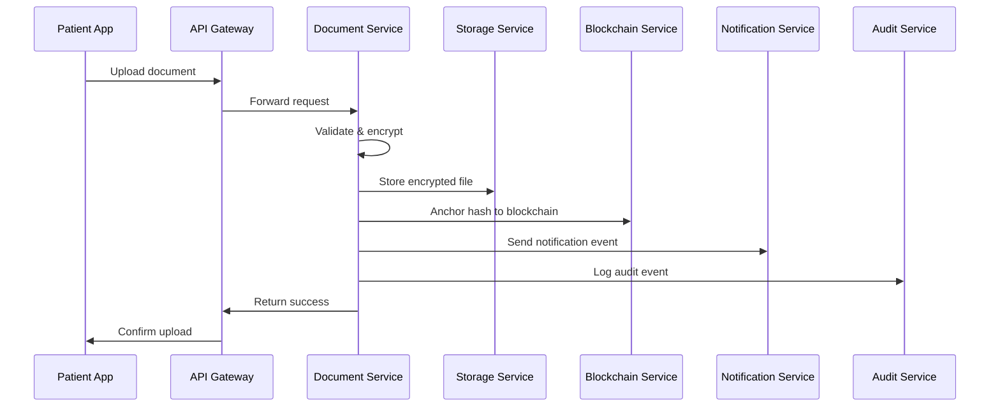
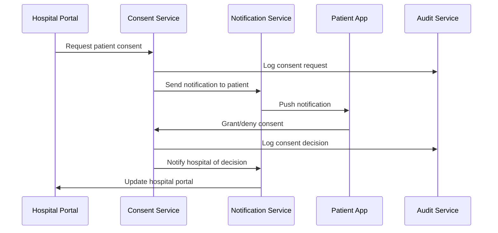

# 🏗️ Updated SecureHealth Platform Architecture

## 📋 Overview

This document outlines the complete updated architecture for the SecureHealth Platform, incorporating all the recommended improvements and additional services for a production-ready healthcare management system.

## 🎯 Architecture Goals

- **Modular Scalability**: Independent services that can scale independently
- **Compliance & Auditability**: HIPAA, GDPR, IRDAI compliance with comprehensive audit trails
- **Real-time Updates**: Event-driven architecture for instant synchronization
- **Offline Support**: Robust offline mode with automatic sync when online
- **Security**: End-to-end encryption, blockchain verification, and secure key management
- **Performance**: Caching, optimization, and efficient resource utilization

## 🏗️ Complete Architecture Diagram

```
┌─────────────────────────────────────────────────────────────────────────────────┐
│                           Frontend Layer                                        │
│  ┌─────────────────┐  ┌─────────────────┐  ┌─────────────────┐                │
│  │   Patient App   │  │  Hospital App   │  │   Admin Panel   │                │
│  │  (React/Next)   │  │  (React/Next)   │  │  (React/Next)   │                │
│  └─────────────────┘  └─────────────────┘  └─────────────────┘                │
└─────────────────────────────────────────────────────────────────────────────────┘
                                        │
                                        ▼
┌─────────────────────────────────────────────────────────────────────────────────┐
│                        API Gateway & Load Balancer                              │
│                    (Kong/Nginx + Rate Limiting + CORS)                         │
└─────────────────────────────────────────────────────────────────────────────────┘
                                        │
                                        ▼
┌─────────────────────────────────────────────────────────────────────────────────┐
│                          Service Mesh (Istio/Linkerd)                          │
│                        (mTLS, Traffic Management, Monitoring)                   │
└─────────────────────────────────────────────────────────────────────────────────┘
                                        │
                                        ▼
┌─────────────────────────────────────────────────────────────────────────────────┐
│                              Microservices Layer                                │
│  ┌─────────────┐  ┌─────────────┐  ┌─────────────┐  ┌─────────────┐          │
│  │    Auth     │  │   Patient   │  │  Document   │  │  Hospital   │          │
│  │   Service   │  │   Service   │  │   Service   │  │   Service   │          │
│  │  (Port 3004)│  │  (Port 3001)│  │  (Port 3002)│  │  (Port 3003)│          │
│  └─────────────┘  └─────────────┘  └─────────────┘  └─────────────┘          │
│  ┌─────────────┐  ┌─────────────┐  ┌─────────────┐  ┌─────────────┐          │
│  │Notification │  │   Consent   │  │    Audit    │  │ Blockchain  │          │
│  │   Service   │  │   Service   │  │   Service   │  │   Service   │          │
│  │  (Port 3006)│  │  (Port 3007)│  │  (Port 3008)│  │  (Port 3005)│          │
│  └─────────────┘  └─────────────┘  └─────────────┘  └─────────────┘          │
└─────────────────────────────────────────────────────────────────────────────────┘
                                        │
                                        ▼
┌─────────────────────────────────────────────────────────────────────────────────┐
│                            Event Bus (Kafka)                                   │
│                    (Real-time Communication & Event Streaming)                  │
└─────────────────────────────────────────────────────────────────────────────────┘
                                        │
                                        ▼
┌─────────────────────────────────────────────────────────────────────────────────┐
│                              Data Layer                                         │
│  ┌─────────────┐  ┌─────────────┐  ┌─────────────┐  ┌─────────────┐          │
│  │  MongoDB    │  │ PostgreSQL  │  │    Redis    │  │Elasticsearch│          │
│  │ (Documents) │  │(Transactions)│  │   (Cache)   │  │  (Search)   │          │
│  └─────────────┘  └─────────────┘  └─────────────┘  └─────────────┘          │
│  ┌─────────────┐  ┌─────────────┐  ┌─────────────┐  ┌─────────────┐          │
│  │    AWS S3   │  │    IPFS     │  │  InfluxDB   │  │   MinIO     │          │
│  │(File Storage)│  │(Decentralized)│  │(Time Series)│  │ (Object Store)│      │
│  └─────────────┘  └─────────────┘  └─────────────┘  └─────────────┘          │
└─────────────────────────────────────────────────────────────────────────────────┘
                                        │
                                        ▼
┌─────────────────────────────────────────────────────────────────────────────────┐
│                          Blockchain Layer                                       │
│  ┌─────────────┐  ┌─────────────┐  ┌─────────────┐  ┌─────────────┐          │
│  │Hyperledger  │  │   Polygon   │  │Smart        │  │  Ethereum   │          │
│  │   Fabric    │  │  (Public L2)│  │Contracts    │  │  (Mainnet)  │          │
│  │ (Private)   │  │             │  │(Audit Trail)│  │             │          │
│  └─────────────┘  └─────────────┘  └─────────────┘  └─────────────┘          │
└─────────────────────────────────────────────────────────────────────────────────┘
```

## 🔧 Service Details

### 1. **Authentication Service** (Port 3004)
- **Purpose**: Centralized authentication and authorization
- **Features**:
  - JWT/OAuth2 authentication
  - ABHA integration for Indian users
  - Multi-factor authentication
  - Role-based access control (RBAC)
  - Session management
- **Dependencies**: Keycloak, ABHA APIs
- **Database**: PostgreSQL (user sessions, permissions)

### 2. **Patient Service** (Port 3001)
- **Purpose**: Patient profile and health record management
- **Features**:
  - Patient registration and profile management
  - Health timeline tracking
  - Family member management
  - Privacy preferences
- **Dependencies**: Auth Service, Document Service
- **Database**: MongoDB (patient profiles, health data)

### 3. **Document Service** (Port 3002)
- **Purpose**: Document upload, encryption, and management
- **Features**:
  - Secure document upload
  - AES-256 encryption
  - SHA-256 hashing
  - Malicious content detection
  - IPFS integration
  - Blockchain hash anchoring
- **Dependencies**: Storage Service, Blockchain Service
- **Database**: MongoDB (document metadata)

### 4. **Hospital Service** (Port 3003)
- **Purpose**: Hospital management and patient linking
- **Features**:
  - Hospital registration and verification
  - Staff user management
  - Patient search and linking
  - Document access management
  - Analytics and reporting
- **Dependencies**: Auth Service, Patient Service, Document Service
- **Database**: MongoDB (hospital data, staff, patient links)

### 5. **Notification Service** (Port 3006)
- **Purpose**: Multi-channel notification delivery
- **Features**:
  - Email notifications (SMTP)
  - SMS notifications (Twilio)
  - Push notifications (Firebase)
  - In-app notifications
  - Template management
  - Delivery tracking
- **Dependencies**: Kafka, External APIs
- **Database**: MongoDB (notification history, templates)

### 6. **Consent Service** (Port 3007)
- **Purpose**: Patient consent management
- **Features**:
  - Consent request/response workflow
  - Granular permission management
  - Consent history tracking
  - Automatic expiration handling
  - Digital signature support
- **Dependencies**: Auth Service, Notification Service
- **Database**: MongoDB (consent records)

### 7. **Audit Service** (Port 3008)
- **Purpose**: Comprehensive audit logging and compliance
- **Features**:
  - Immutable audit logs
  - Compliance reporting (HIPAA, GDPR, IRDAI)
  - Security event monitoring
  - Data access tracking
  - Retention policy management
- **Dependencies**: Kafka, Elasticsearch
- **Database**: Elasticsearch (audit logs), InfluxDB (metrics)

### 8. **Blockchain Service** (Port 3005)
- **Purpose**: Blockchain integration and verification
- **Features**:
  - Document hash anchoring
  - Proof of existence
  - Smart contract interactions
  - Multi-chain support
  - Verification workflows
- **Dependencies**: Hyperledger Fabric, Polygon
- **Database**: PostgreSQL (blockchain transactions)

## 🔄 Event-Driven Architecture

### Event Types and Topics

```yaml
# Patient Events
patient.registered:
  - Triggered when new patient registers
  - Consumers: Notification Service, Audit Service

patient.updated:
  - Triggered when patient profile changes
  - Consumers: Hospital Service, Audit Service

# Document Events
document.uploaded:
  - Triggered when document is uploaded
  - Consumers: Blockchain Service, Notification Service, Audit Service

document.verified:
  - Triggered when document is blockchain verified
  - Consumers: Hospital Service, Notification Service

# Consent Events
consent.requested:
  - Triggered when hospital requests patient consent
  - Consumers: Notification Service, Audit Service

consent.granted:
  - Triggered when patient grants consent
  - Consumers: Hospital Service, Document Service, Notification Service

consent.denied:
  - Triggered when patient denies consent
  - Consumers: Hospital Service, Notification Service, Audit Service

# Hospital Events
hospital.registered:
  - Triggered when hospital registers
  - Consumers: Audit Service, Notification Service

hospital.verified:
  - Triggered when hospital is verified
  - Consumers: Hospital Service, Notification Service

# System Events
system.error:
  - Triggered on system errors
  - Consumers: Audit Service, Notification Service

system.health:
  - Triggered for health checks
  - Consumers: Monitoring Service
```

## 💾 Data Architecture

### Database Strategy

| Service | Primary DB | Secondary DB | Purpose |
|---------|------------|--------------|---------|
| **Auth Service** | PostgreSQL | Redis | Sessions, permissions |
| **Patient Service** | MongoDB | Redis | Profiles, health data |
| **Document Service** | MongoDB | Elasticsearch | Metadata, search |
| **Hospital Service** | MongoDB | Redis | Hospital data, cache |
| **Notification Service** | MongoDB | Redis | History, templates |
| **Consent Service** | MongoDB | PostgreSQL | Consent records |
| **Audit Service** | Elasticsearch | InfluxDB | Logs, metrics |
| **Blockchain Service** | PostgreSQL | - | Transactions |

### Caching Strategy

```typescript
// Redis Cache Patterns
const CACHE_KEYS = {
  // Patient cache (TTL: 1 hour)
  PATIENT_PROFILE: (patientId: string) => `patient:profile:${patientId}`,
  PATIENT_DOCUMENTS: (patientId: string) => `patient:documents:${patientId}`,
  
  // Hospital cache (TTL: 30 minutes)
  HOSPITAL_PROFILE: (hospitalId: string) => `hospital:profile:${hospitalId}`,
  HOSPITAL_PATIENTS: (hospitalId: string) => `hospital:patients:${hospitalId}`,
  
  // Document cache (TTL: 2 hours)
  DOCUMENT_METADATA: (documentId: string) => `document:metadata:${documentId}`,
  
  // Session cache (TTL: 24 hours)
  USER_SESSION: (sessionId: string) => `session:${sessionId}`,
  
  // Rate limiting (TTL: 1 minute)
  RATE_LIMIT: (userId: string, action: string) => `rate_limit:${userId}:${action}`,
};
```

## 🔐 Security Architecture

### Encryption Strategy

1. **Data at Rest**:
   - Database encryption using AES-256
   - File storage encryption (S3, IPFS)
   - Key management via AWS KMS/CloudHSM

2. **Data in Transit**:
   - TLS 1.3 for all communications
   - mTLS for service-to-service communication
   - Certificate pinning for mobile apps

3. **Application Security**:
   - JWT tokens with short expiration
   - Refresh token rotation
   - Rate limiting and DDoS protection
   - Input validation and sanitization

### Blockchain Security

1. **Document Integrity**:
   - SHA-256 hashing of all documents
   - Blockchain anchoring for tamper-proof verification
   - Multi-chain redundancy (Hyperledger + Polygon)

2. **Audit Trail**:
   - Immutable logs on blockchain
   - Cryptographic signatures for all actions
   - Time-stamped proof of existence

## 📊 Monitoring & Observability

### Metrics Collection

```yaml
# Application Metrics
- Request latency and throughput
- Error rates by service
- Database query performance
- Cache hit/miss ratios
- API response times

# Infrastructure Metrics
- CPU, memory, disk usage
- Network I/O and latency
- Kubernetes pod health
- Database connection pools

# Business Metrics
- User registration rates
- Document upload volumes
- Consent approval rates
- Hospital verification times
```

### Logging Strategy

```yaml
# Log Levels
ERROR: System errors, failures, security breaches
WARN:  Performance issues, deprecated API usage
INFO:  Business events, user actions, system state
DEBUG: Detailed execution flow, variable values

# Log Destinations
- Application logs → ELK Stack (Elasticsearch, Logstash, Kibana)
- Audit logs → Blockchain + Elasticsearch
- Metrics → Prometheus + Grafana
- Traces → Jaeger
```

## 🚀 Deployment Architecture

### Kubernetes Configuration

```yaml
# Service Deployment
apiVersion: apps/v1
kind: Deployment
metadata:
  name: patient-service
spec:
  replicas: 3
  selector:
    matchLabels:
      app: patient-service
  template:
    spec:
      containers:
      - name: patient-service
        image: securehealth/patient-service:latest
        ports:
        - containerPort: 3001
        env:
        - name: MONGODB_URI
          valueFrom:
            secretKeyRef:
              name: db-secrets
              key: mongodb-uri
        resources:
          requests:
            memory: "256Mi"
            cpu: "250m"
          limits:
            memory: "512Mi"
            cpu: "500m"
```

### Service Mesh Configuration

```yaml
# Istio Virtual Service
apiVersion: networking.istio.io/v1alpha3
kind: VirtualService
metadata:
  name: patient-service
spec:
  http:
  - match:
    - uri:
        prefix: /api/v1/patients
    route:
    - destination:
        host: patient-service
        port:
          number: 3001
    timeout: 30s
    retries:
      attempts: 3
      perTryTimeout: 10s
```

## 🔄 Data Flow Examples

### Document Upload Flow



### Consent Management Flow



## 📈 Scalability Considerations

### Horizontal Scaling

1. **Stateless Services**: All services designed to be stateless
2. **Database Sharding**: Patient data sharded by region/ID
3. **CDN Integration**: Static assets served via CDN
4. **Auto-scaling**: Kubernetes HPA based on CPU/memory metrics

### Performance Optimization

1. **Caching Layers**:
   - Redis for session and frequently accessed data
   - CDN for static content
   - Database query result caching

2. **Database Optimization**:
   - Read replicas for read-heavy operations
   - Connection pooling
   - Query optimization and indexing

3. **Async Processing**:
   - Document processing in background
   - Email/SMS queuing
   - Bulk operations

## 🔒 Compliance & Governance

### HIPAA Compliance

- **Administrative Safeguards**: Access controls, audit logs, incident response
- **Physical Safeguards**: Data center security, device controls
- **Technical Safeguards**: Encryption, access controls, audit controls

### GDPR Compliance

- **Data Minimization**: Collect only necessary data
- **Consent Management**: Granular consent tracking
- **Right to Erasure**: Data deletion capabilities
- **Data Portability**: Export user data

### IRDAI Compliance

- **Data Localization**: Indian data residency requirements
- **Audit Trails**: Comprehensive logging for regulatory compliance
- **Security Standards**: Implementation of prescribed security measures

## 🚀 Future Enhancements

### Phase 1 (Current)
- ✅ Core microservices architecture
- ✅ Hospital portal with basic features
- ✅ Document upload and verification
- ✅ Basic audit logging

### Phase 2 (Next 3 months)
- 🔄 Notification service implementation
- 🔄 Consent management system
- 🔄 Enhanced audit service
- 🔄 Event-driven architecture

### Phase 3 (6 months)
- 📋 AI-powered health insights
- 📋 Telemedicine integration
- 📋 IoT device integration
- 📋 Advanced analytics

### Phase 4 (12 months)
- 📋 Insurance integration
- 📋 Pharmacy integration
- 📋 Research data sharing
- 📋 Global expansion

## 📚 API Documentation

### Service Endpoints

```yaml
# Authentication Service
POST /api/v1/auth/login
POST /api/v1/auth/register
POST /api/v1/auth/refresh
GET  /api/v1/auth/profile

# Patient Service
GET    /api/v1/patients/{id}
PUT    /api/v1/patients/{id}
GET    /api/v1/patients/{id}/timeline
POST   /api/v1/patients/{id}/family-members

# Document Service
POST   /api/v1/documents/upload
GET    /api/v1/documents/{id}
DELETE /api/v1/documents/{id}
GET    /api/v1/documents/{id}/verify

# Hospital Service
GET    /api/v1/hospitals
POST   /api/v1/hospitals
GET    /api/v1/hospitals/{id}
POST   /api/v1/hospitals/{id}/patients/search
POST   /api/v1/hospitals/{id}/patients/{patientId}/link

# Notification Service
POST   /api/v1/notifications/send
GET    /api/v1/notifications/{recipientId}
PUT    /api/v1/notifications/{id}/read

# Consent Service
POST   /api/v1/consent/request
PUT    /api/v1/consent/{id}/respond
GET    /api/v1/consent/{patientId}/history

# Audit Service
GET    /api/v1/audit/logs
GET    /api/v1/audit/compliance-report
POST   /api/v1/audit/export
```

## 🎯 Success Metrics

### Technical Metrics
- **Availability**: 99.9% uptime
- **Performance**: <200ms API response time
- **Scalability**: Support 1M+ users
- **Security**: Zero data breaches

### Business Metrics
- **User Adoption**: 80% of hospitals onboarded
- **Document Processing**: 10K+ documents/month
- **Compliance**: 100% audit trail coverage
- **User Satisfaction**: 4.5+ rating

---

This architecture provides a robust, scalable, and compliant foundation for the SecureHealth Platform, ready for production deployment and future enhancements.


